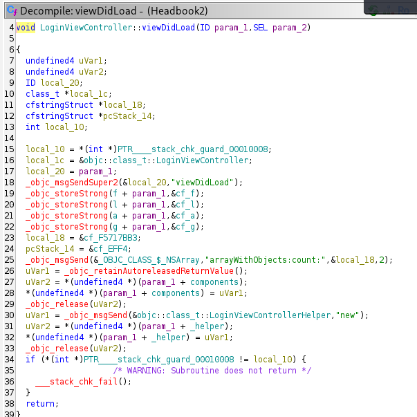

# Mobile CTF Challenges Version 2.0 - Challenge 1/5

This is the link for the recording: https://www.youtube.com/watch?v=LXA04vObwcc 
The link for the CTF: https://ivrodriguez.com/mobile-ctf/

After downloading the ipa file and using unzip, I started with the same strategy that I took for challenges in Version 1.0.
I started searching for the key word flag, "grep -r 'flag' ." and found this match: 
grep: ./Headbook: binary file matches

I then used the tool strings on the Headbook binary and found these strings:

strings Headbook | grep flag
Good thing this flag is encrypted: Ov630qDn5AbOWX4JIUUeurVdgNdsjqiaM8ywYCT2Yj1eiMcT/MEPJJ5W9icdC5qb
Good thing this flag is encrypted: Ov630qDn5AbOWX4JIUUeurVdgNdsjqiaM8ywYCT2Yj1eiMcT/MEPJJ5W9icdC5qb

In order to get more context I printed the lines from above and below:

strings Headbook| grep -A 5 -B 5 flag

T@"LoginViewControllerHelper",&,N,V_helper
U>OJ=;9=OUH::=UL<I<U:>LAUK:OM:<N>A<;9
4E73
A0E3
79888631BC61
Good thing this flag is encrypted: Ov630qDn5AbOWX4JIUUeurVdgNdsjqiaM8ywYCT2Yj1eiMcT/MEPJJ5W9icdC5qb
enc_key
hash
TI,R
superclass
T#,R

We can see that we have a part of the flag. I then started to search for this string using Ghidra as it looks like a name of a function or a class: "LoginViewControllerHelper".
Looking around in Ghidra, I've found the first part of the flag in the viewDidLoad method of the class LoginViewController. 

This is the full flag:
flag-F5717BB3-EFF4-4E73-A0E3-79888631BC61
