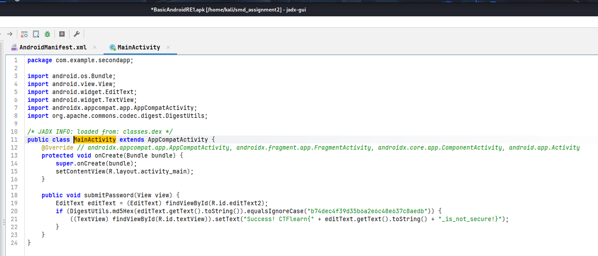
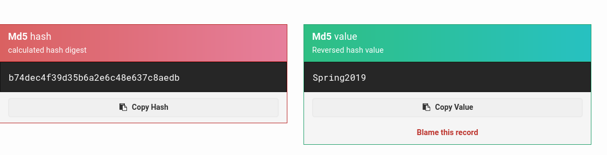
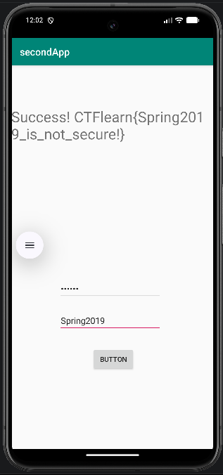

#===CTF Learn Basic Android RE=== 

The link for my solution: https://www.youtube.com/watch?v=zMM8n_xesBY
The link for the CTF: https://ctflearn.com/challenge/962 

For this challenge, I used the Jadx tool to decompile the APK file received and Android Studio with an emulator to test the app. After decompiling the APK file I went to look directly 
into the MainActivity file to understand the flow of the app.

We have a login interface and if we input the correct password we get the flag. In the submitPassword method we see that the password that we input is md5 hashed and then is compared to
a hardcoded hash. 

We know that MD5 is not secure anymore and I went online to search for MD5 decryption tools and found this site that got me the password: https://md5hashing.net/hash/md5

Finally, the final flag is "CTFlearn{Spring2019_is_not_secure!}".

