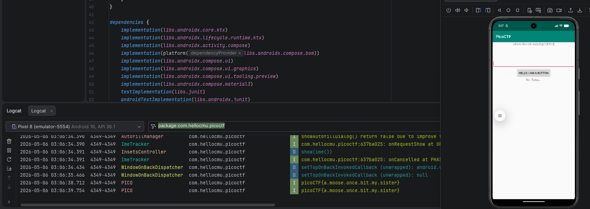

# Challenge 1 - droids0

The link for the video: https://youtu.be/EShH_zAT2io
The link for the challenge: https://play.picoctf.org/practice?page=1&search=droids

For this challenge I used jadx-gui to decompile the apk file and look through the main activity. On the main activity there's a button and some hints which got me thinking that maybe the 
flag is somewhere in the logs. Looking at the code we can also see a class named FlagstafHill which has a method that sends a log.

I installed the app on an emulator in Android Studio using adb to see how the app behaves. 

adb install zero.apk

Using the functionality of Logcat in Android Studio we can see the flag when we press the button on the main activity:

