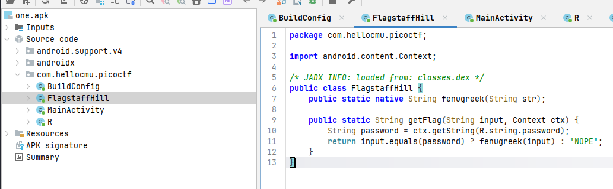
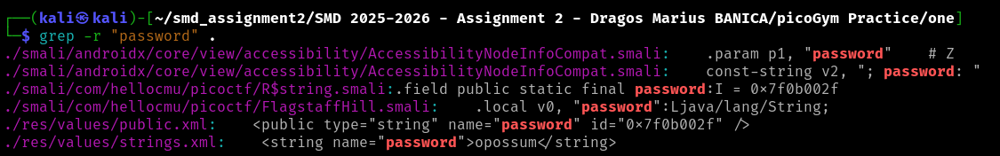
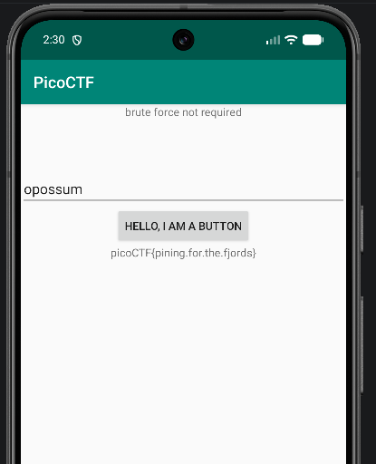

# Challenge 2 - droids1

The link for the recording: https://youtu.be/hW6S92oCgHM  
The link for the challenge: https://play.picoctf.org/practice?page=1&search=droids

For this challenge I started to install the apk file on an emulator in Android Studio using adb: adb install one.apk 

In the main activity we have a screen with a button. Looking at the code using jadx-gui we see that we need to input a password in order to get the flag.
So if the string that we input matches the password we get the flag.

I also used apktool to decompile the apk file and search for this specific password using grep.

apktool d one.apk
cd one
grep -r "password" .

We got several matches and we can see the password is "opossum":

When we input the password we finnaly get the flag:

 

