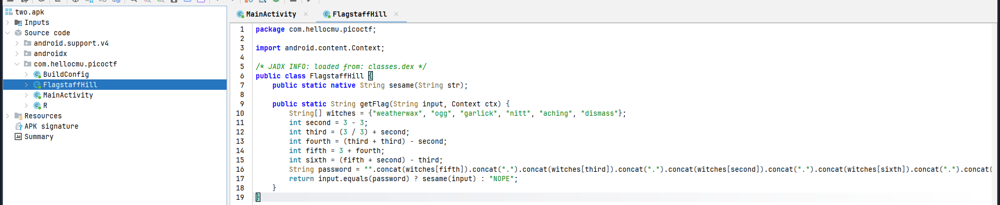
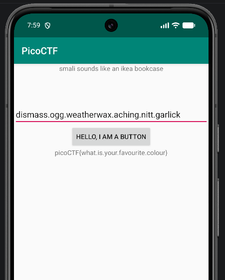

# Challenge 3 - droids2 

The link for the recording: https://youtu.be/2y4h6JPaFiI
The link for the challenge: https://play.picoctf.org/practice?page=1&search=droids

For this challenge I've used an android emulator in Android Studio and jadx-gui decompiller to look at the source code. 

Looking at the FlagstaffHill class, we see the logic of the method responsible for checking the input in the main activity and how the password is created.

Taking a pen and pencil, I've gone through the process and we have: 

second = 0
third = 1 
fourth = 2
fifth = 5
sixth = 4

password = dismass.ogg.weatherwax.aching.nitt.garlick

When we input this password we get the flag: 

 
