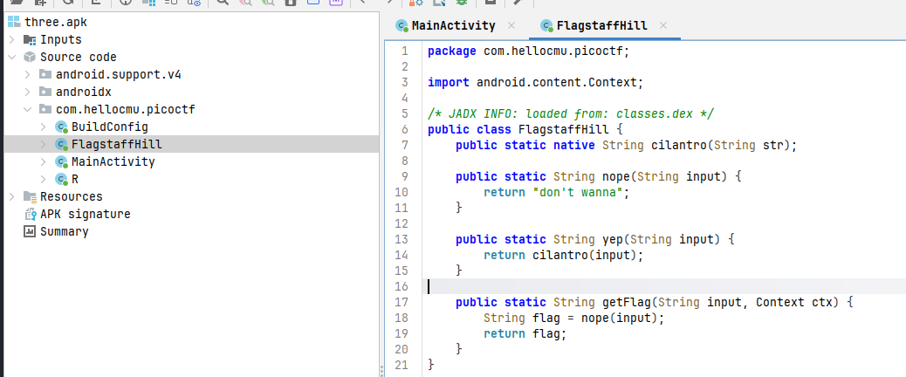
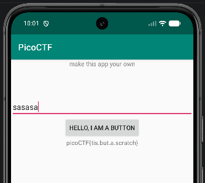

# Challenge 4 - droids3

The link for the recording: https://youtu.be/6Q29G6_JabE  
The link for the challenge: https://play.picoctf.org/practice?page=1&search=droids

For this challenge I've gone thru the source code directly using jadx-gui and we can see in the FlagstuffHill class that the flag is supposed to be returned for any input 
but there's a catch, we can see 2 different methods, one is returning a "NOPE" string and the other one is returning the flag but is not part of the flow of execution. 

So I figured out that I need to call that method somehow. At first, I tried Frida to call that function but couldn't figure it out so I learned that we can use apktool not just 
to decompile but also to compile. 

apktool d three.apk 

Then I used nano to edit the FlagstaffHill.smali file and change "nope" into "yep" which is the name of the method.

nano three/smali/com/hellocmu/picoctf/FlagstaffHill.smali 
apktool b three -o three_mod.apk

After this I learned that we also need to sign the apk file and I've done this using these commands which first creates a keystore and then uses apksigner to sign the apk file:

keytool -genkey -v -keystore mykey.jks -alias myalias -keyalg RSA -keysize 2048 -validity 10000
apksigner sign --ks mykey.jks three_mod.apk

Then I uninstalled the unmodified apk from the emulator because there was an issue with the signatures and I installed the new apk file which is modified using adb:

adb uninstall com.hellocmu.picoctf
adb install three_mod.apk

Finnally, when I press the button in the app, the flag will appear: 

