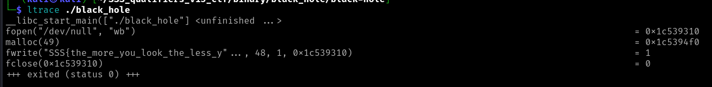
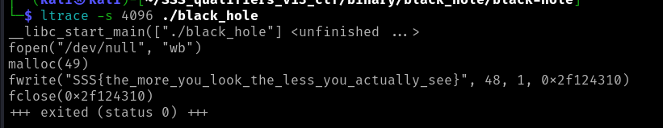

# Binary: Qualifiers: Black Hole

For this challenge I started by running the program but nothing happened so I've done some inspection using different tools like ghidra, strings and ltrace. 
What seems to have got me rolling was ltrace, which intercepts and records the dynamic library calls and system calls made by the executable.

ltrace ./black_hole

Here we can see that the executable calls fwrite and it shows a part of the flag. In order to get the entire string I've used ltrace -s 4095 ./black_hole to show the entire flag.

-s - specifies the length of the string (32 is default)

