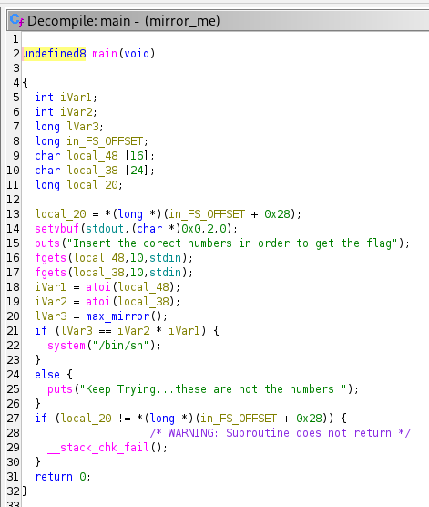
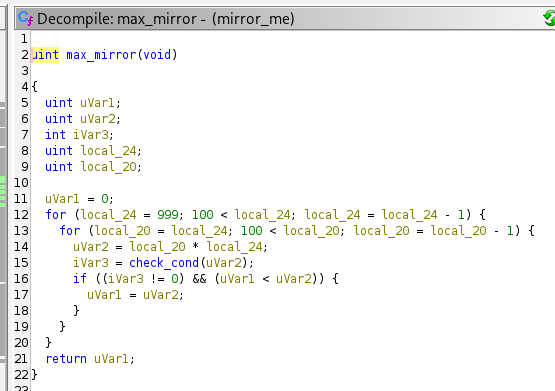
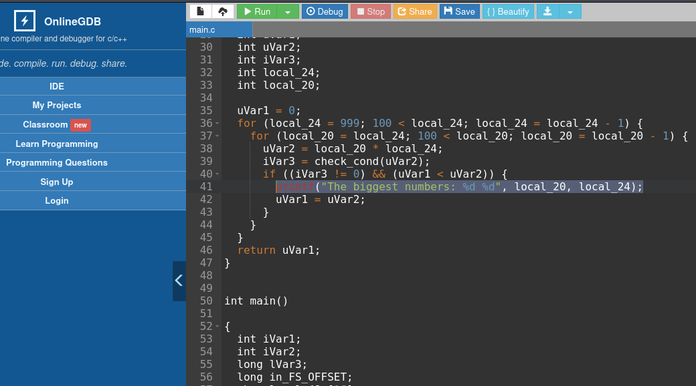
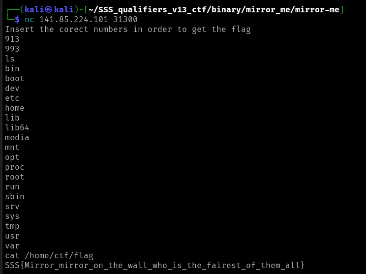

# Binary: Qualifiers: Mirror Me

When we run the binary it promts us to type 2 numbers and it appears to need a perfect match in order to output the flag so I started to look at the binary using ghidra.

In the main function we can see the logic, so there is a multiplication of the 2 numbers that we input and it checks for a match. Going further, we can see a function named
mirror_me being called which contains two nested for loops both going from 999 to 100. 

Each numbers between 999 and 100 are being multiplied and another function named check_cond is being called. 

This check_cond function checks the number for being a palindrom and returns true if so and false otherwise.
Ultimately, the bigger picture is that the numbers that we need to input needs to be the biggest numbers between 999 and 100 and multipling them we obtain a palindrom number. 

In order to figure out the numbers I've put the code in an online C compiler and put a printf to obtain these big numbers which multiplied gives us a palindrom number.

So the magic numbers are 913 and 993. Ultimately, we get the flag by connecting with nc to the remote server and the flag is in /home/ctf/.

 
