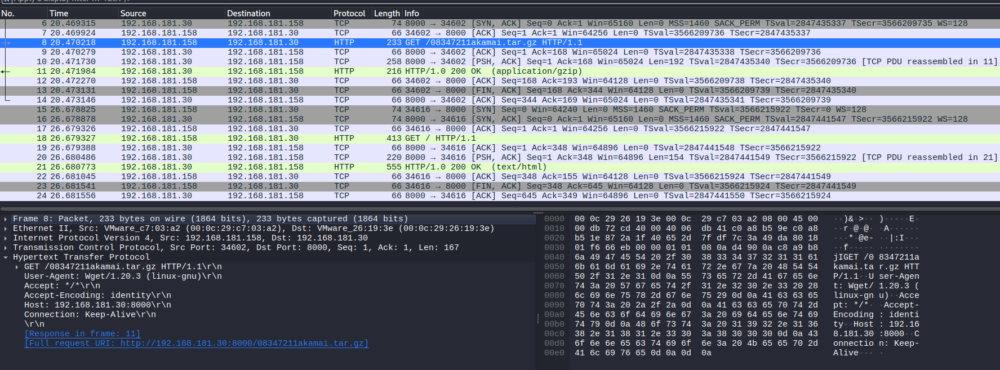
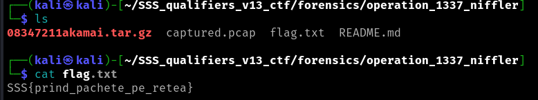

# Forensics: Qualifiers: Operation 1337 Niffler 

For this challenge I've opened the pcap file in Wireguard to see the packets. We can see there is a HTTP GET request for an archive named "08347211akamai.tar.gz" and the file
is then transmited.

I've reconstructed the file in Wireshark and then extracted it:

File -> Export objects -> HTTP 
tar -xzf 08347211akamai.tar.gz

Finally, we can see the flag:

