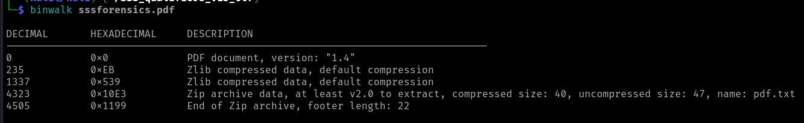
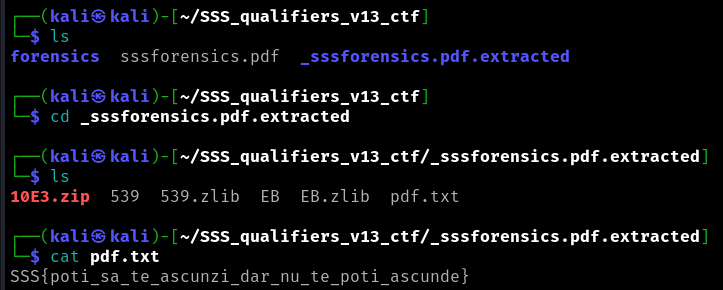

# Forensics: Qualifiers: Operation Last Read

When I opened the pdf from the challenge we can't see much, just a blank file with a string: "nothing to see here". From the description there is a hint that leads to using binwalk. 
With binwalk we can see if there are any hidden files inside the pdf so I tried it:

binwalk sssforensics.pdf 

From the output we can see the pdf contains a file named pdf.txt so I started to extract it using: 

binwalk -e sssforensics.pdf

Inside the pdf.txt file we can see the flag:

 
