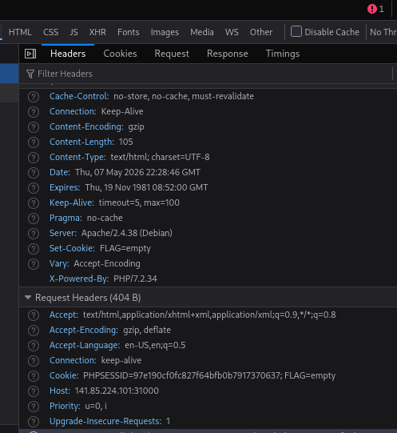
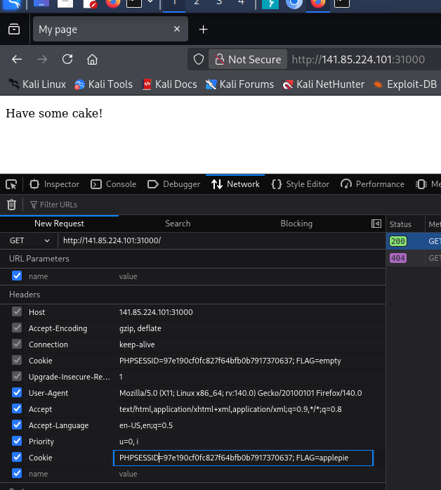

# Web: Qualifiers: Cake

For this challenge we don't see much when we access the webpage at http://141.85.224.101:31000/ so I inspected the webpage with dev tools in the browser.
Looking at the response we see a hint about what to do next. 

The Set-Cookie header has the value: FLAG=empty. So I figured out that we need to put FLAG=applepie which is from the description of the challenge. I've modified the cookie header this
way:

Finally, we get the response which contains the flag: SSS{hansel_gretel}

