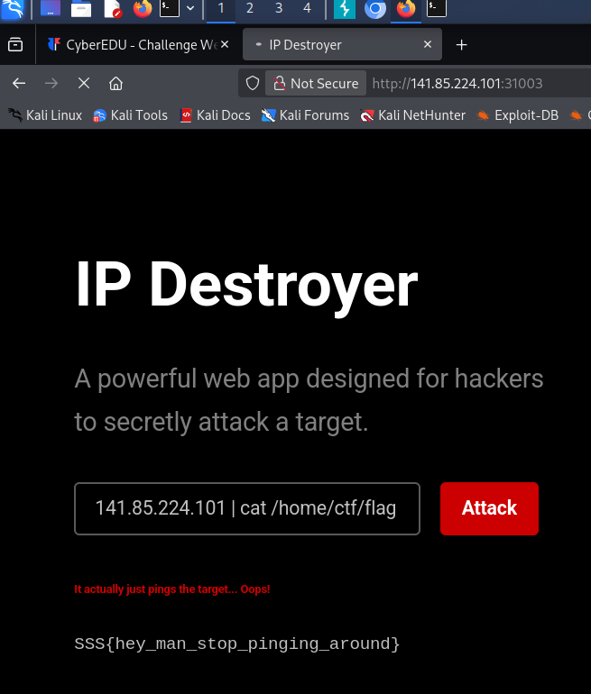

# Web: Qualifiers: IP Destroyer

For this challenge I've started by testing if the form is vulnerable and I tried a ls command:

We can see that there's no verification for the input and we can obtain the flag by using cat /home/ctf/flag:

